# API REST de Gestión de Productos - UTN Programación III

Este es el Trabajo Práctico Integrador para la materia Programación III de la Tecnicatura Universitaria en Programación de la UTN.

## 1. Descripción del Proyecto

El objetivo de este proyecto es el desarrollo de una **API REST** completa para la gestión de productos de un e-commerce. La API permite realizar operaciones CRUD (Crear, Leer, Actualizar, Eliminar) sobre la entidad `Producto`.

El proyecto implementa una arquitectura en capas profesional, separando la lógica en:
* **Controladores** (Endpoints de la API)
* **Servicios** (Lógica de negocio)
* **Repositorios** (Acceso a datos)
* **Modelos** (Entidades y Enums)
* **DTOs** (Data Transfer Objects) para validar entradas y formatear salidas 
* **Manejo Global de Excepciones** (`@ControllerAdvice`) 

## 2. Tecnologías Utilizadas

* **Java 21** (JDK 21)
* **Spring Boot 3.3.0** (Framework principal)
* **Maven** (Gestor de dependencias)
* **Spring Web**: Para la creación de controladores REST. 
* **Spring Data JPA**: Para la persistencia de datos. 
* **H2 Database**: Base de datos en memoria para pruebas. 
* **Bean Validation**: Para las validaciones en los DTOs. 
* **Lombok**: Para reducir el código boilerplate en modelos y DTOs.
* **Springdoc OpenAPI (Swagger)**: Para la documentación interactiva de la API. 
* **Spring Boot DevTools**: Para reinicios automáticos en desarrollo. 

## 3. Instrucciones para Clonar y Ejecutar 

1.  **Clonar el repositorio:**
    ```bash
    git clone [URL-DE-TU-REPOSITORIO-GITHUB]
    ```

2.  **Navegar a la carpeta del proyecto:**
    ```bash
    cd productos-api
    ```

3.  **Ejecutar el proyecto con Maven:**
    (Asegúrate de tener Java 21 y Maven instalados)
    ```bash
    mvn spring-boot:run
    ```

4.  La aplicación se iniciará en `http://localhost:8080`.

## 4. Acceso a Herramientas 

* **API (Swagger UI):**
  `http://localhost:8080/swagger-ui/index.html`

* **Base de Datos (H2 Console):**
  `http://localhost:8080/h2-console`
   * **JDBC URL:** `jdbc:h2:mem:productosdb`
   * **User Name:** `sa`
   * **Password:** ``

## 5. Tabla de Endpoints 

| Método | Ruta HTTP | Descripción                                                   |
| :--- | :--- |:--------------------------------------------------------------|
| `POST` | `/api/productos` | Crea un nuevo producto.                                       |
| `GET` | `/api/productos` | Lista todos los productos.                                    |
| `GET` | `/api/productos/{id}` | Obtiene un producto por su ID.                                |
| `GET` | `/api/productos/categoria/{categoria}` | Filtra productos por categoría.                               |
| `PUT` | `/api/productos/{id}` | Actualiza un producto completo.                   |
| `PATCH` | `/api/productos/{id}/stock` | Actualiza solo el stock de un producto.           |
| `DELETE` | `/api/productos/{id}` | Elimina un producto por su ID.                    |

## 6. PARTE 7: Testing y Validación Final


Prueba tu API completa usando Swagger UI:
1. Crear productos:
   ○ Crea al menos 5 productos de diferentes categorías
   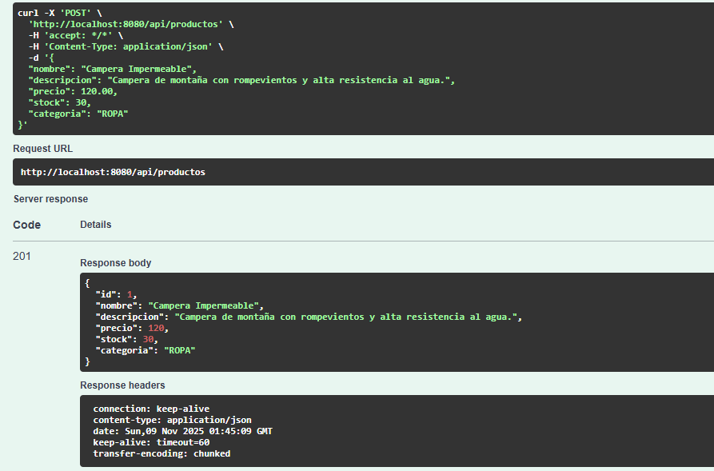
   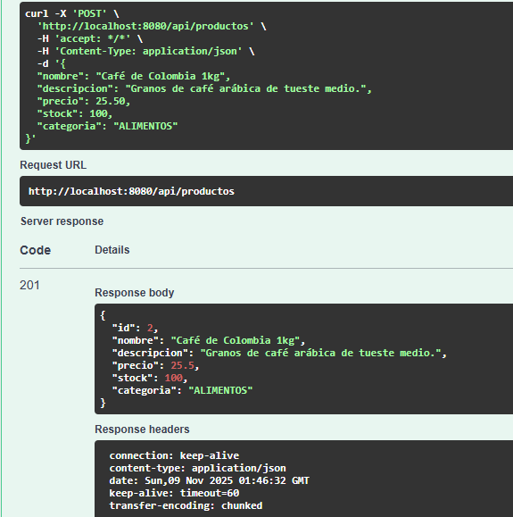
   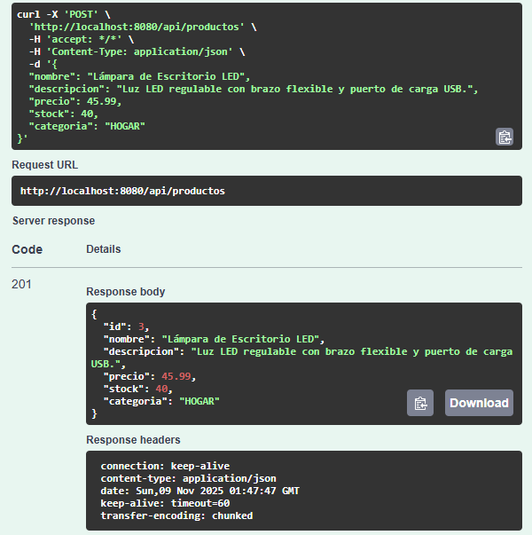
   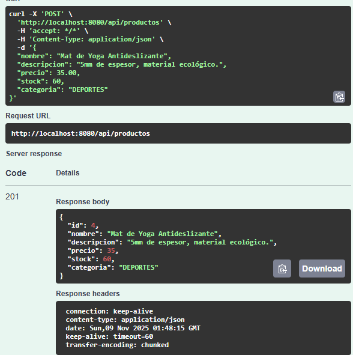
   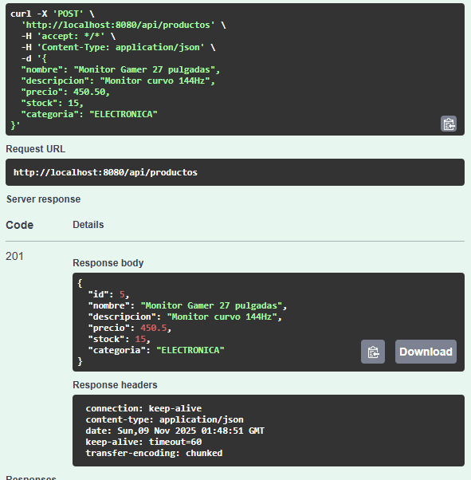
   ○ Intenta crear un producto sin nombre (debe fallar con 400)
   
   ○ Intenta crear un producto con precio negativo (debe fallar con 400)
   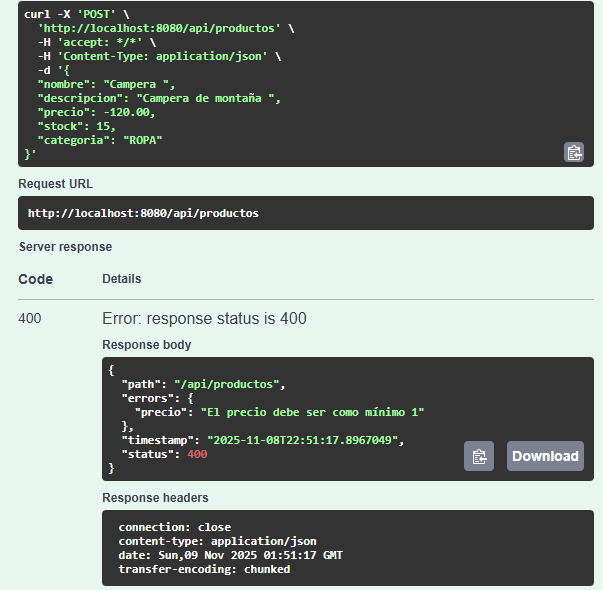
   ○ Captura pantalla de una creación exitosa
   
2. Listar productos:
   ○ Lista todos los productos
   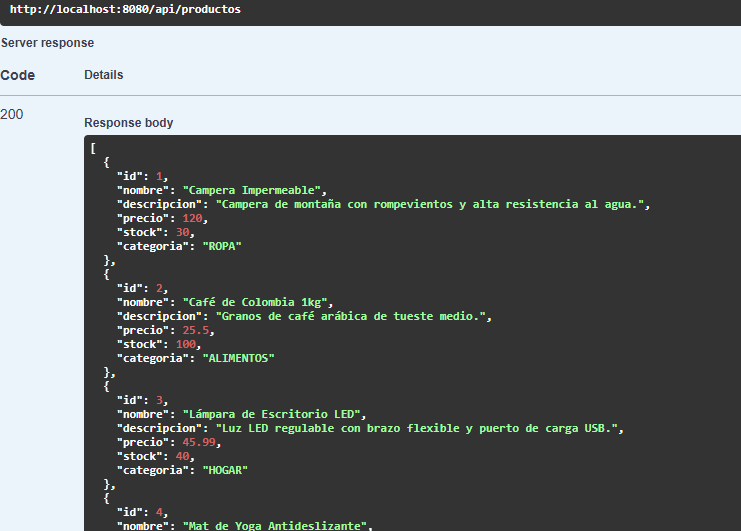
   ○ Filtra por una categoría específica
   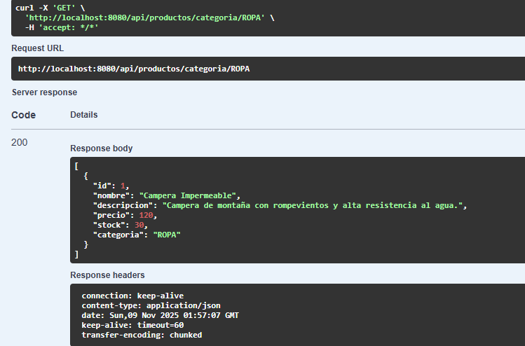
   ○ Captura pantalla de los resultados
3. Obtener producto por ID:
   ○ Obtén un producto existente
   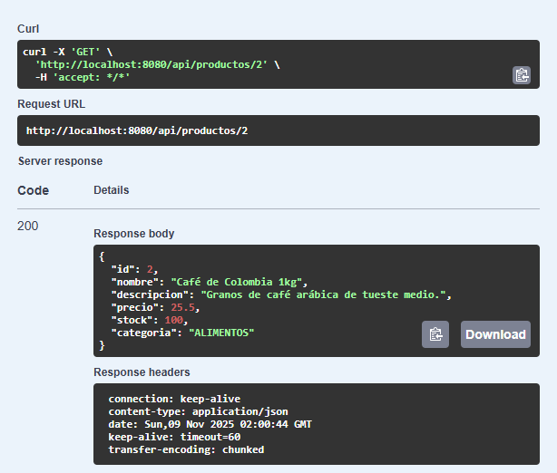
   ○ Intenta obtener un ID que no existe (debe retornar 404)
   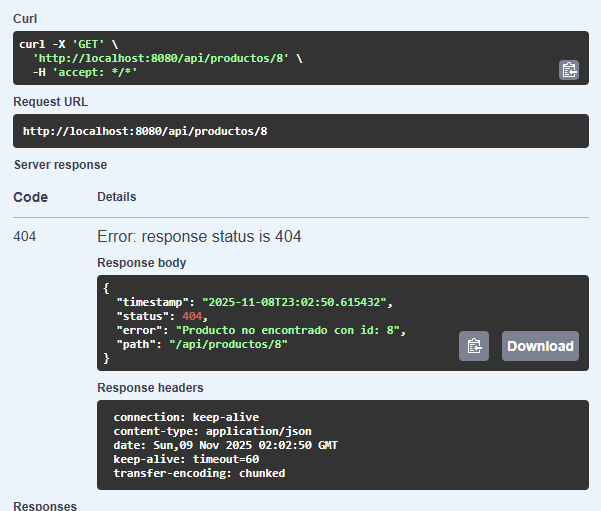
   ○ Captura pantalla del error 404
4. Actualizar producto:
   ○ Actualiza un producto completo con PUT
   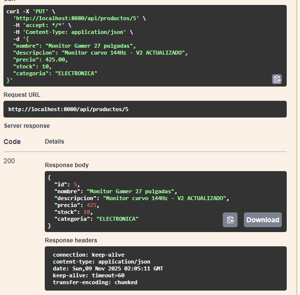
   ○ Actualiza solo el stock con PATCH
   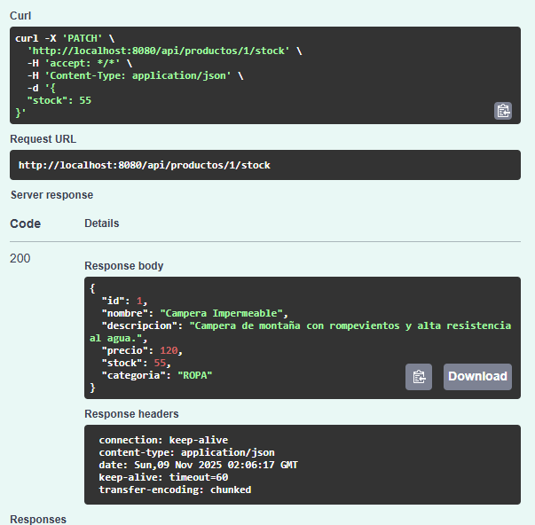
   ○ Captura pantalla de ambas operaciones
5. Eliminar producto:
   ○ Elimina un producto
   ○ Verifica que retorna 204
   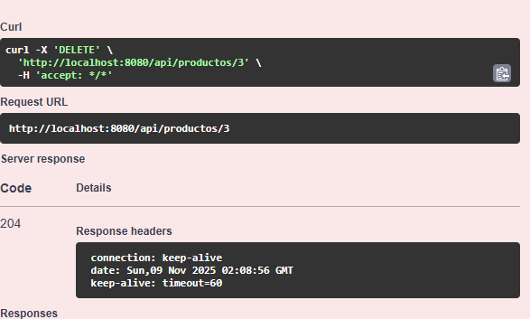
   ○ Intenta obtenerlo nuevamente (debe dar 404)
   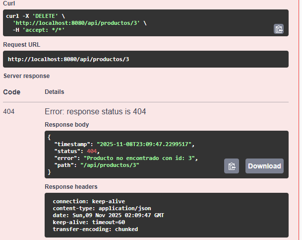
6. Verificar en H2:
   ○ Accede a la consola H2
   ○ Verifica que los datos se persistieron correctamente
   ○ Captura pantalla de la tabla productos
   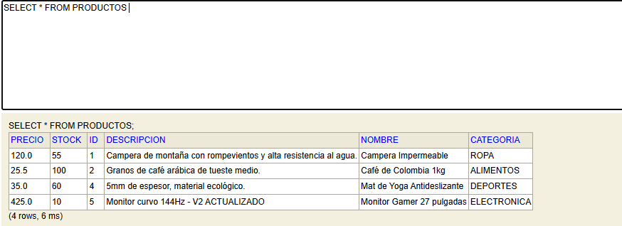

* *Aprendí a implementar una arquitectura en capas en un proyecto real de Spring Boot.*
* *Comprendí la importancia de los DTOs para no exponer las entidades y para validar los datos de entrada.*
* *La implementación de un manejador de excepciones global con `@ControllerAdvice` me permitió centralizar los errores 404 y 400 de forma profesional.*
* *La configuración de Swagger (Springdoc) me pareció fundamental para poder probar la API de forma interactiva y facil.*

## 8. Autor

* **Azul Castroviejo:** 
* **Legajo:** 52622